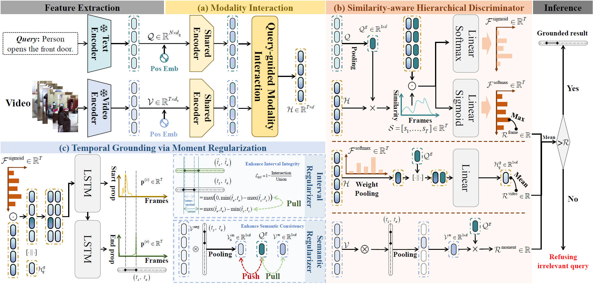

# MCN: Moment-Centric Network for Open-Set Temporal Sentence Grounding

<div align="center">

  

  **A PyTorch implementation of MCN for Open-Set Video Moment Retrieval**

  [](https://www.python.org/downloads/release/python-370/)
  [](https://pytorch.org/)
  [](https://developer.nvidia.com/cuda-toolkit)
  [](LICENSE)

</div>

---

## Table of Contents

- [Overview](#overview)
- [Environments](#environments)
- [Datasets&Preparation](#Datasets&Preparation)
- [Training](#training)
- [Evaluation](#evaluation)
- [Framework Architecture](#framework-architecture)
- [Acknowledgement](#acknowledgement)

---

## Overview

**MCN (Moment-Centric Network)** is a deep learning framework designed for **Open-Set Temporal Sentence Grounding (OpenTSG)** in videos. Unlike traditional Temporal Sentence Grounding which assumes queries are always relevant, OpenTSG must determine whether a query is relevant to the video and, if so, localize the corresponding timestamps.

### Motivation

Existing TSG methods typically assume that the input query is always relevant to the video content, lacking the ability to identify irrelevant queries. These methods derive video-query relevance only from frame-level and video-level features, making them susceptible to spurious frame associations and irrelevant content interference.

### Our Solution

MCN explicitly models relevance at the **moment level** while enhancing moment feature discrimination through:
- **Semantic consistency** between queries and relevant moments (via contrastive learning)
- **Interval integrity** for accurate temporal boundary prediction (via IoU loss)

### Key Features

- **Similarity-Aware Hierarchical Discriminator**: Assesses relevance at moment, frame, and video levels
- **Moment-Level Relevance Scoring**: Alleviates spurious frame-level matches through candidate moment feature extraction
- **Cosine Similarity Integration**: Explicitly incorporates global query-to-frame similarity to suppress irrelevant content
- **Temporal Grounding with Regularization**: Semantic regularizer (contrastive) + Interval regularizer (IoU)
- **Parameter Efficiency**: Achieves optimal grounding performance with fewer parameters

---

## Environments

- __Ubuntu__ 20.04
- __CUDA__ 11.7
- __Python__ 3.7

Install other required packages by

```bash
pip install transformers==4.25.1
pip install timm==0.6.12
pip install tqdm
pip install h5py
pip install tensorboard
pip install opencv-python
pip install scikit-learn
pip install nltk
```

---

## Datasets&Preparation

For dataset download and preparation, please refer to: [https://github.com/HuiGuanLab/RaTSG](https://github.com/HuiGuanLab/RaTSG)

---

## Training

**Train MCN on Charades-STA-RF dataset**:

```bash
bash charades_RF_train.sh
```

**Train MCN on ActivityNet Captions-RF dataset**:

```bash
bash activitynet_RF_train.sh
```

The training scripts support hyperparameter tuning via loop variables:
- `seed`: Random seed for reproducibility
- `alpha`: IoU loss weight (interval regularizer)
- `mom_loss`: Contrastive loss weight (semantic regularizer)

---

## Evaluation
Modify line 177 in main.py, add model_dir="ckpt/MCN_activitynet_RF_i3d_128", and then run the corresponding bash file.

**Test MCN on Charades-STA-RF dataset**:

```bash
bash charades_RF_test.sh
```

**Test MCN on ActivityNet Captions-RF dataset**:

```bash
bash activitynet_RF_test.sh
```

We release pretrained checkpoints. Download and put them into `./ckpt/`:
- MCN on Charades-STA-RF: `MCN_charades_RF_i3d_128`
- MCN on ActivityNet Captions-RF: `MCN_activitynet_RF_i3d_128`

---

## Framework Architecture

<div align="center">

  

  **Figure**: Overview of the MCN framework for Open-Set Temporal Sentence Grounding. The framework consists of three main modules: (1) Modal interaction module for multimodal feature generation, (2) Similarity-aware hierarchical discriminator for comprehensive relevance assessment, and (3) Temporal grounding module with moment regularization.

</div>

### Key Components

#### 1. Modal Interaction Module
Generates multimodal features using pre-extracted video and query features:
- Query Encoder with word/character embeddings
- Visual Projection for I3D features
- Transformer-based encoder with multi-head attention
- Cross-Attention (CQ) for video-text interaction

#### 2. Similarity-Aware Hierarchical Discriminator
Comprehensively assesses query relevance at three granularities:

| Level | Method | Purpose |
|-------|--------|---------|
| **Moment** | Masking + Matching | Alleviates spurious frame matches |
| **Frame** | Cosine Similarity | Suppresses irrelevant content |
| **Video** | Aggregation | Final relevance decision |

#### 3. Temporal Grounding Module with Moment Regularization

| Regularizer | Type | Function |
|-------------|------|----------|
| **Semantic** | Contrastive Learning | Query-moment alignment |
| **Interval** | IoU Loss | Boundary accuracy & completeness |

**Total Loss Formula**:
```
Total Loss = CE_Loss + γ × BCE_Loss + β × BF_Loss + α × IoU_Loss + λ × Contrastive_Loss
```

---

## Acknowledgement

This implementation is based on insights from the following works:

- [RaTSG](https://github.com/HuiGuanLab/RaTSG) - Ranking-based Temporal Sentence Grounding with Relevance Feedback
- [VSLNet](https://github.com/tencent-ailab/VSLNet) - Video Structured Localization Network
- [2D-TAN](https://github.com/tttony2622/2D-TAN) - 2D Temporal Adjacency Network

We thank the original authors for their valuable contributions to the field.

---

## License

This project is licensed under the MIT License - see the [LICENSE](LICENSE) file for details.

---

<div align="center">

  **For questions and feedback, please open an issue or contact [Your Email]**

  ⭐ If you find this repository helpful, please consider giving it a star!

</div>
